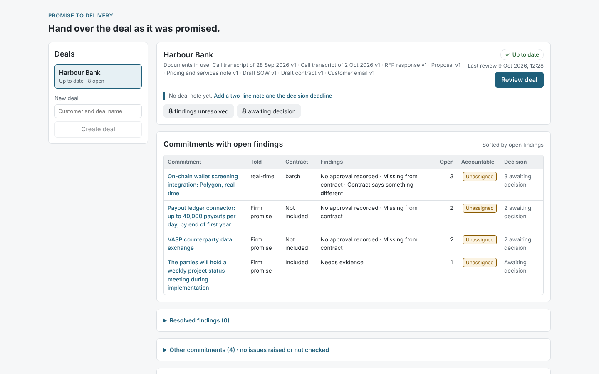

# Promise to Delivery

**Hand over the deal as it was promised.**

When a deal is signed, Delivery inherits the contract — but the customer remembers the proposal, the RFP answers and the calls. Promise to Delivery reads a deal's paper trail and builds the handoff record: each promise in its exact words and source, flagged where the customer was told more than the contract includes, or more than the company approved. People fix those gaps with evidence, and a recheck shows which ones actually closed.

*Demonstrated on fictional deals with a complete capability catalogue.* A local prototype built in October 2026 to learn how to design, build and evaluate an AI system end to end.



## What it catches

| | Example (Harbour Bank, fictional) |
| --- | --- |
| **A promise stronger than the company authorised** | The proposal promises real-time Polygon wallet screening from launch; the catalogue says it is in beta and needs named approval; the pricing note records none. |
| **A promise that disappeared from the contract without being withdrawn** | The contract, through the SOW it incorporates, commits to hourly batch screening. Nothing withdraws the real-time promise. |
| **Terms that conflict across documents** | Real-time in the proposal, batch in Annex A. |

One commitment can carry several of these at once, and they close independently: an approval does not put a promise into the contract.

## How it works

1. **Read.** Upload the deal's documents (Markdown, text, PDF, Word, Excel, PowerPoint), each with its type confirmed by a person.
2. **Extract (the model).** Claude reads each document and returns every promise with its exact quote, how firmly it was stated (exploratory, conditional or firm) and who said it. Every quote is checked word for word against the source.
3. **Decide (rules).** Promises are grouped by their terms, not their wording. Rules check each firm promise against the catalogue and the pricing note (authorisation) and follow the contract's references into the SOW and annexes (contractual presence). Rules make the findings because their verdicts can be checked.
4. **Fix and recheck.** Attach evidence inside a finding — a named exception, an aligned SOW — and the same rules re-evaluate every finding. A finding closes only when the evidence meets what it needs. *Okay to proceed* and *Must fix before signing* are recorded beside a finding and never change it.
5. **Hand over.** A saved, versioned handoff for Delivery, Customer Success and Support, with CSV and readable exports; unresolved items stay visible.

## Where the AI comes in — and where it doesn't

The model reads the paperwork and extracts promises with verifiable quotes. Rules decide, because their verdicts can be traced to a catalogue line or a contract clause. I also built a bounded agent to catch reworded promises the rules miss: it read all five paraphrased cases correctly in substance, but could not back any verdict with evidence in the form the code verifies, so under a decision rule written before the comparison, it does not decide anything yet. A revised agent (v2) has only been smoke-tested; its first real test is the sealed run.

## Results

*To be completed after the single sealed run on 14 Oct (Coral Pay, unseen until then): baseline vs rules [vs agent], exact cases, cost, and what failed.*

| Metric | Target | Result |
| --- | --- | --- |
| Recall, firm commitments | ≥ 90% | |
| Precision after housekeeping filter | ≥ 85% | |
| Quote validity | 100% | |
| Planted conflicts reaching review | 3 of 3 | |
| False flags on clean commitments | 0 | |
| Resolution scenarios behaving as expected (development deal, real model) | 5 of 5 | 5 of 5 (10 Oct) |

## Known limitations (stated plainly)

- **Paraphrase.** The rules found 0 of 5 reworded approval issues in a practice set; they reached review as *Needs evidence*, not as findings.
- **A recheck does not re-read unchanged documents** when extraction settings change: an unchanged version keeps the extraction it already had. Each review records which settings every document was read under and says so when they differ.
- **Re-confirmation is deal-wide.** Any new evidence asks for every earlier decision to be re-confirmed. Safe, but noisy on a large deal; narrowing it needs dependency tracking.
- **Synthetic data, small set.** Results describe performance on fictional deals written for this build, not generalisation.
- **Formats.** PDF text layer only (no OCR); Excel by stored values only; PowerPoint slide text only (not speaker notes). Office formats are checked on development documents only.
- **Not in this build:** post-signature tracking, live CRM or Drive connectors, AI-suggested business impact, legal advice.

## How it was tested

- A labelled development deal, hard cases written to break extraction, and a practice set for rules vs agent.
- A sealed test deal (Coral Pay) that no code read before one final run per configuration.
- Regression checks on extraction; five resolution scenarios; 568 automated tests; a seal on every entry point that keeps the test deal out of the app.
- One real reviewer session (Head of Growth). It showed the idea landed and the first interface did not; the screens were redesigned from it.

## Run it locally

```
python -m venv .venv && source .venv/bin/activate
pip install -r requirements.txt
cd frontend && npm ci && cd ..
python reset_demo.py
python -m uvicorn api:app --host 127.0.0.1 --port 8000
# second terminal
cd frontend && npm run dev     # open http://127.0.0.1:5173
```

The demo opens on Harbour Bank with no API key. Reading a new or changed document needs `ANTHROPIC_API_KEY` in the server's terminal; the browser never sees it.

## Where to look

| File | What it is |
| --- | --- |
| `DESIGN.md` | Users, the three-attribute model, the pipeline |
| `DECISIONS.md` | Every design choice, the alternative rejected, and why |
| `LEARNING_LOG.md` | What I learned, got stuck on and got wrong |
| `docs/` | Briefs, the integrity inspection, specs, screens |

## Credits and honesty

All companies, people, products and deal terms are fictional. TRM Labs, Chainalysis and BioCatch are real providers named in the catalogue for realism only; Elva's integrations with them are fictional and no partnership is claimed. Built with Claude Code as build partner; Claude drafted the fictional documents, fixtures and briefs from my direction. The product decisions, labels and evaluation design are mine.
